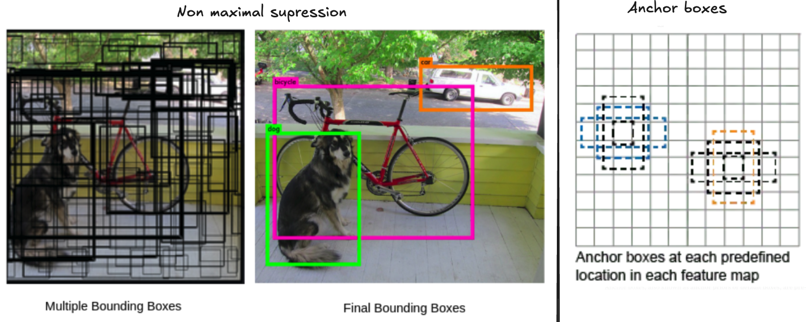
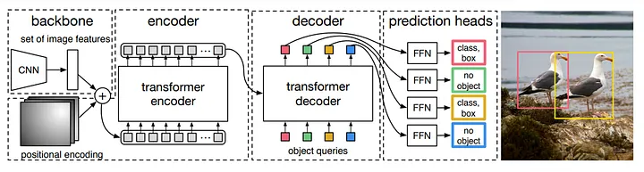
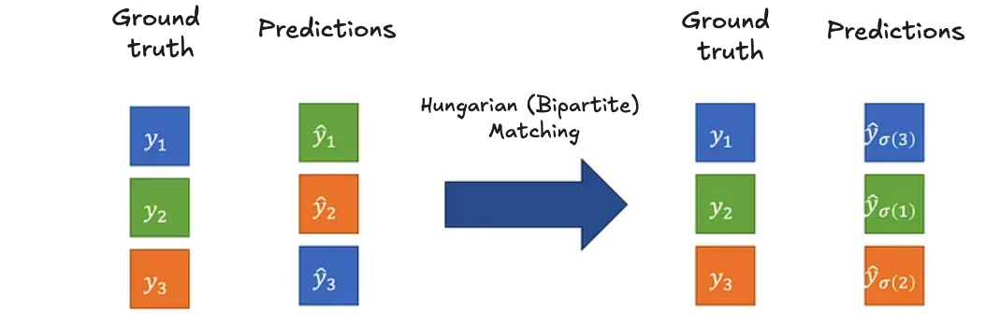
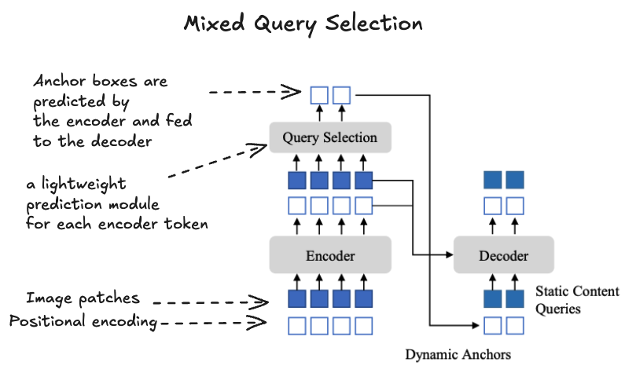
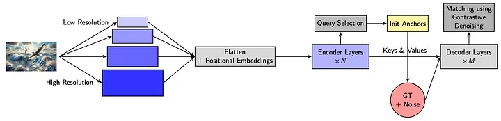
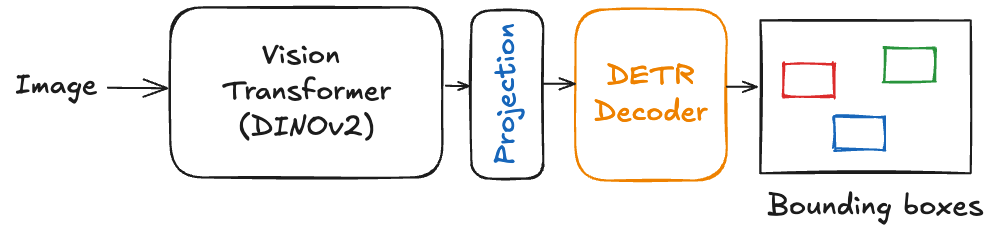

## TL;DR
Object detection models have evolved dramatically over the last five years, pivoting from anchor-based architectures [TODO make it more accisable to layman] towards end-to-end transformer-backed approaches. 
This transition not only improved detection accuracy and scalability, but also sped up convergence and reduced the reliance on manual post-processing. [TODO have a oneliner summary of the below content]

](sumary_scope.png)

# [DETR: End-to-End Object Detection with Transformers (2020)](https://arxiv.org/abs/2005.12872)
DEtection TRansformer (DETR) marked the first successful transformer-based object detector. Its key innovation is the ability to train end to end without relying on traditional components such as:
* Anchor boxes: Predefined bounding boxes of specific sizes and aspect ratios spread uniformly over an image. These serve as reference shapes used by methods relying on region proposals or dense prediction.
* Non-maximum suppression (NMS): A heuristic step that removes duplicated detections by suppressing overlapping boxes with lower confidence.

**DETR Architecture:**
1. The input image passes through a model backbone, extracting a set of dense feature vectors.
2. These features are fed into a transformer encoder, which applies multi-head self-attention. 
3. Positional encodings are added to maintain spatial information since transformers are permutation invariant.
4. The transformer decoder receives a fixed number of learnable object queries. Each query predicts an object or no object, and the decoder’s cross-attention layers relate queries to encoded image features. 
   * Notice this means the number of object queries is pre-defined and needs to be larger than the largest #object in the dataset.
5. All objects are predicted simultaneously in a single forward pass, removing the need for post-processing like NMS.

**The DETR loss function** can be simply understood as a two-step process:
1. Hungarian (bipartite) matching: Finding the best unique assignment between predicted objects and ground truth by minimizing a cost combining classification confidence and bounding box similarity. This matching enforces a one-to-one correspondence and ensures no duplicated detections
2. After matching, a standard loss is computed on the matched pairs: (i) Classification loss (cross-entropy between predicted and true class labels) and (ii) Bounding box loss (a combination of L1 and IoU loss).

DETR was a breakthrough by removing the need for manual steps with anchor boxes and suppression. But it trains slower than traditional methods and matches their accuracy without clearly beating them, leaving space to improve speed and performance.

## [DINO: DETR with Improved DeNoising Anchor Boxes (2022)](https://arxiv.org/pdf/2203.03605)
*Notice this is not related to Meta's DINOV2/V3*

DINO (DETR with Improved DeNoising Anchor Boxes) built directly upon DETR, aiming to fix its main issues: slow convergence and suboptimal detection of small or overlapping objects. It introduced a few architectural and training refinements that helped DETR-like models become faster, more accurate, and easier to train

DINO's novelty:
1. Contrastive Denoising Training: DINO generates both positive (slightly perturbed) and hard negative (noisier) box queries from ground truth, explicitly teaching the model to reconstruct objects from positives and reject negatives. This minimizes duplicate predictions and drastically improves query-to-object assignment stability.

2. Mixed Query Selection: Instead of initializing all decoder queries from learned embeddings (like DETR) or directly from encoder features, DINO uses encoder-derived coordinates for query positions (anchors) and keeps the content embeddings learned and static. This hybrid gives strong spatial priors without noisy content initialization. With more details: The encoder predicts bounding boxes and objectness scores for many image regions. The top-K highest scoring boxes from these predictions are used to initialize the positional part (anchor coordinates) of decoder queries, while the semantic content embeddings of queries remain separately learned and fixed.

3. Look-Forward-Twice Mechanism: Intermediate decoder layer outputs are supervised both directly and via gradient flow from later layers

DINO set a new standard in transformer-based object detection by elegantly solving DETR’s bottlenecks and inspiring a wave of research and applications. Its core ideas—learned anchors, contrastive matching, and improved gradient flow—now guide training strategies beyond detection. The model is accessible, practical, and its techniques are broadly shaping future end-to-end vision models.

[RF-DETR: A SOTA Real-Time Object Detection Model (2025)](https://blog.roboflow.com/rf-detr/)
Roboflow Detection Transformer (RF-DETR) is a transformer-based object detector focused on real-time performance, achieving state of the art performance (over 60 mAP on the COCO dataset) while running above 25 FPS on NVIDIA T4 GPUs. It advances efficient object detection by combining innovations from prior DETR variants with state-of-the-art pre-training.

Key Components from Deformable DETR and LW-DETR:
From Deformable DETR: 
1. Introduces efficient transformer architecture optimized for low latency inference comparable to YOLO models (introduced in LW-DETR).
2. Integrates latency-aware design choices including reduced decoder layers and lighter attention computations to achieve real-time speed without losing accuracy (introduced in LW-DETR).
3. Employs multi-scale feature sampling to extract key image details at various resolutions (introduced in Deformable DETR)
4. Uses deformable attention mechanisms which attend only to a small set of spatial key points instead of every pixel  (introduced in Deformable DETR)
5. Integrates a DINOv2 backbone pretrained via self-supervised learning for superior visual feature extraction that enables rapid adaptation across domaains.

RF-DETR represents the cutting edge of real-time object detection by uniting deformable attention, efficient transformer design, and powerful pre-training. 
It delivers state-of-the-art accuracy with the speed needed for practical deployment across a variety of applications

## Reference

Traditional 
* https://medium.com/@nikitamalviya/object-detection-anchor-box-vs-bounding-box-bf1261f98f12

DETR:
* https://arxiv.org/pdf/2005.12872
* https://dzdata.medium.com/detr-end-to-end-object-detection-with-transformers-f40ce77bfe44

DINO DETR
* [DINO DETR](https://arxiv.org/abs/2203.03605)
* https://akmaier.medium.com/how-to-dino-detr-with-improved-denoising-anchor-boxes-d9799f024773

RF-DETR:
* https://blog.roboflow.com/rf-detr/
* https://towardsdatascience.com/rf-detr-under-the-hood-the-insights-of-a-real-time-transformer-detection/
* [LW-DETR: A Transformer Replacement to YOLO for Real-Time Detection. Qiang Chen et. al. 2024.](https://arxiv.org/pdf/2406.03459)
