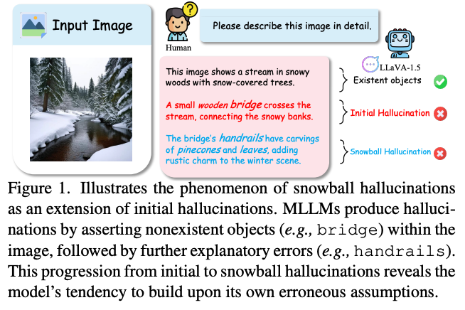
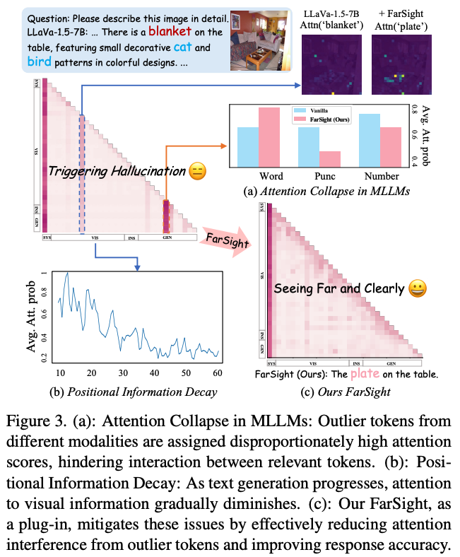

**TL;DR** Hallucinations in multimodal LLMs fall into two categories: initial hallucinations, caused by insufficient model knowledge, and snowball hallucinations, where prior errors are reinforced for consistency. FarSight tackles both by redesigning information propagation: (i) sink tokens absorb uninformative signals to prevent downstream pollution and (ii) attention decay grounds the model in early generation tokens, curbing the snowball effect.

## Motivation

Two key observations drive this work:

1. **Attention collapse**: Models disproportionately attend to low-information tokens (e.g. visual backgrounds and textual symbols), disrupting effective propagation of relevant information.
2. **Positional information decay**: Attention to dense visual information progressively declines during generation. This is a byproduct of Rotary Position Encoding (RoPE), where increasing token distance weakens token influence. Since hallucination risk grows with sequence length, this reinforces snowballing errors.

Together, these observations suggest that balanced information propagation and refined positional encoding can mitigate both failure modes.

## Method

FarSight addresses these issues by intervening in the token interaction process through two complementary mechanisms:

1. **Attention Registers**: absorb attention diverted to outlier tokens within the causal mask.
2. **Positional Awareness Encoding**: uses a diminishing masking rate to preserve long-range dependencies.

Importantly, FarSight can be implemented without modifying the model's existing weights or performing any additional training.

### Attention Registers

Standard Softmax-based attention requires all scores in a row to sum to one, which forces the model to distribute attention even when semantic content is sparse. To address this, a set of dedicated attention register slots within the **upper triangular matrix** of the causal mask are initialized. These slots absorb excess attention that would otherwise land on low-information outlier tokens.

Formally, FarSight constructs an upper-triangular register matrix $P$ where scores follow a decay pattern to match the model's natural attention attenuation:

$$P_{i,j} = -(j - i) \cdot \sigma, \quad \forall j > i$$

These register scores are integrated with the original attention scores $\omega$ and a lower-triangular causal mask $C$ to form the modified attention matrix $W$:

$$W = \omega \cdot C + P, \quad \text{where} \quad C = \operatorname{tril}(\mathbf{1}_{n \times n})$$

The final refined attention distribution $\tilde{W}$ is then computed as:

$$\tilde{W} = \operatorname{SoftMax}(\omega \cdot C + P) \cdot C$$

The inclusion of the causal mask $C$ _outside_ the Softmax is critical: it ensures the model never actually accesses future token information.

### Positional Awareness Encoding

RoPE encodes relative positional information by multiplying rotation matrices into the attention computation, rather than appending positional embeddings to the input. This means closer tokens influence each other more than distant ones. Early tokens are considered more reliable: in multimodal LLMs they contain the dense visual information that grounds text generation, with less chance of snowballing hallucinations.

FarSight addresses this with a positional awareness encoding scheme that applies a diminishing masking rate, preserving long-range dependencies between vision and text tokens and counteracting the progressive decay of visual information during generation.

## Limitations

1. The decay rate in the Positional Awareness Encoding is predetermined rather than learnable, meaning it is not dynamically optimized for the specific characteristics of different datasets.
2. There is a hyperparameter of sequence length (set to 256 tokens based on extensive experiments). The method appears to rely heavily on this value.

## References

- [FarSight Paper](https://arxiv.org/abs/2505.16652)
- [NotebookLM Session](https://notebooklm.google.com/notebook/0431bfd2-c93d-4b4c-a811-f69ecd20462a)
